<p align="center">
  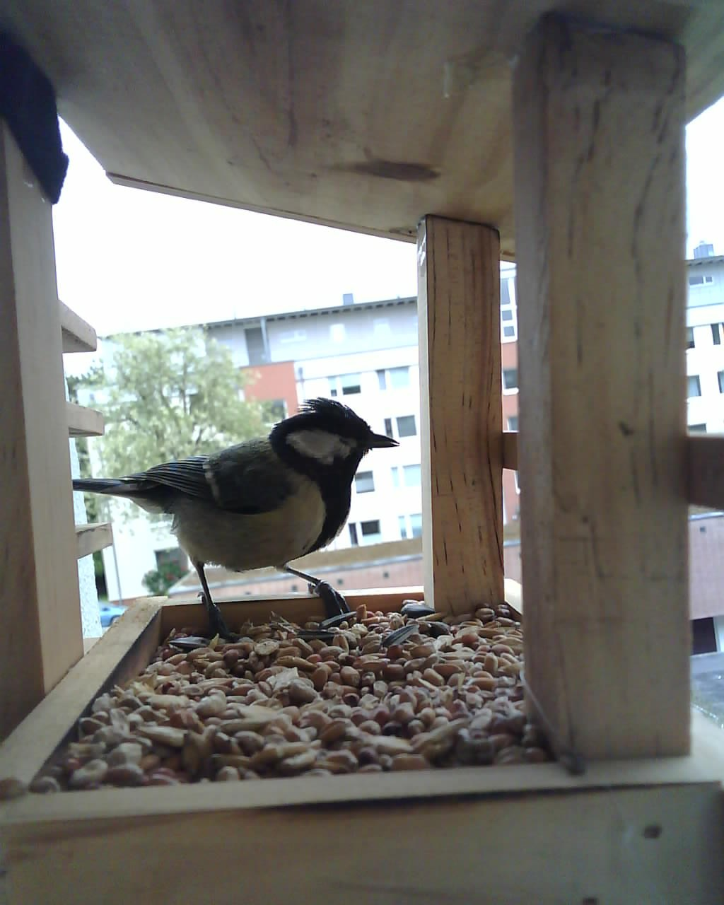
</p>

# birbESP

A weekend project. An AI-Thinker ESP32-CAM strapped to a balcony trellis,
pointed at a wooden bird feeder, with a mobile-first web app on a small
NixOS homelab that catches every visit.

## What it does

- 1 fps capture, 24/7, uploaded over the LAN.
- Server-side highlight detection (per-frame diff) — empty-feeder shots
  stay out of the way; visits stand out.
- Mobile-first web UI: live MJPEG, highlights reel, full gallery,
  video-scrubber for fast review, per-frame download.
- LED control from the phone with a 30-second auto-off.
- LAN-only behind nginx + a local DNS rewrite. HTTPS for browsers; plain
  HTTP on the LAN for the cam's uploads so 1 fps isn't crushed by TLS
  handshakes.

## Captures

<table>
  <tr>
    <td width="50%"></td>
    <td width="50%">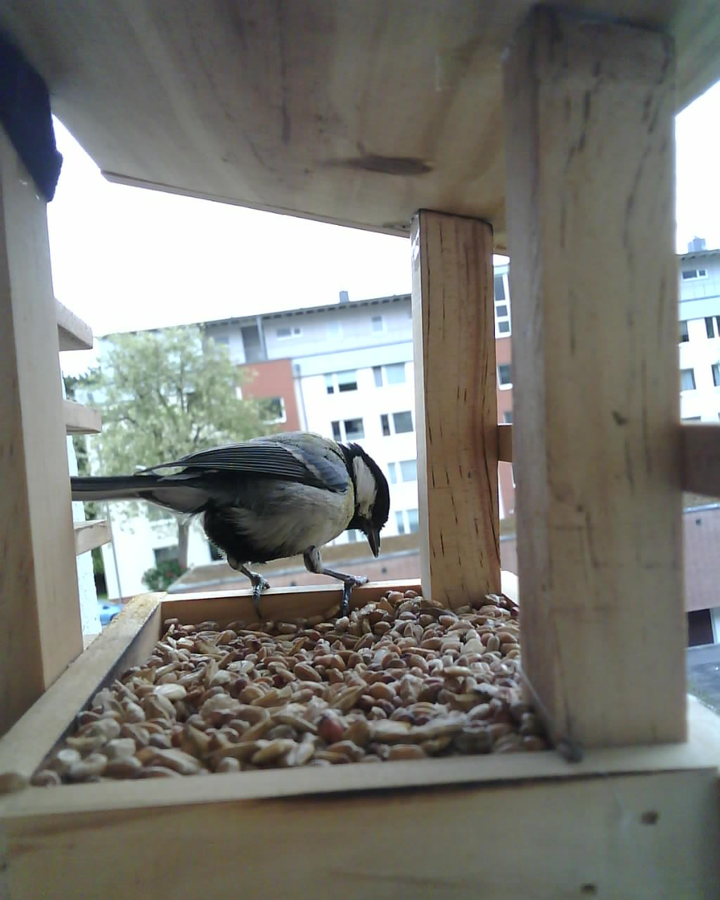</td>
  </tr>
  <tr>
    <td width="50%">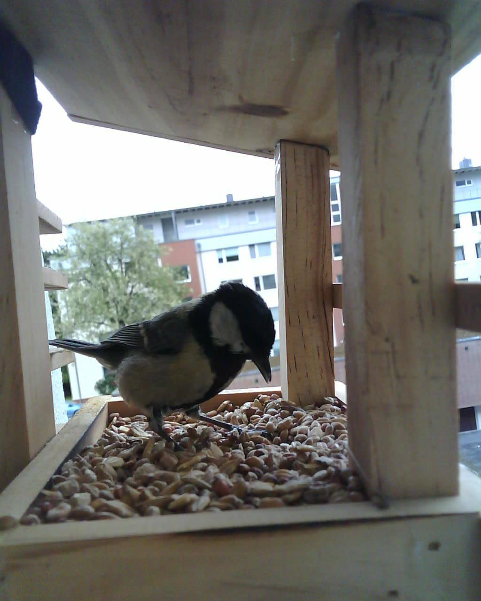</td>
    <td width="50%">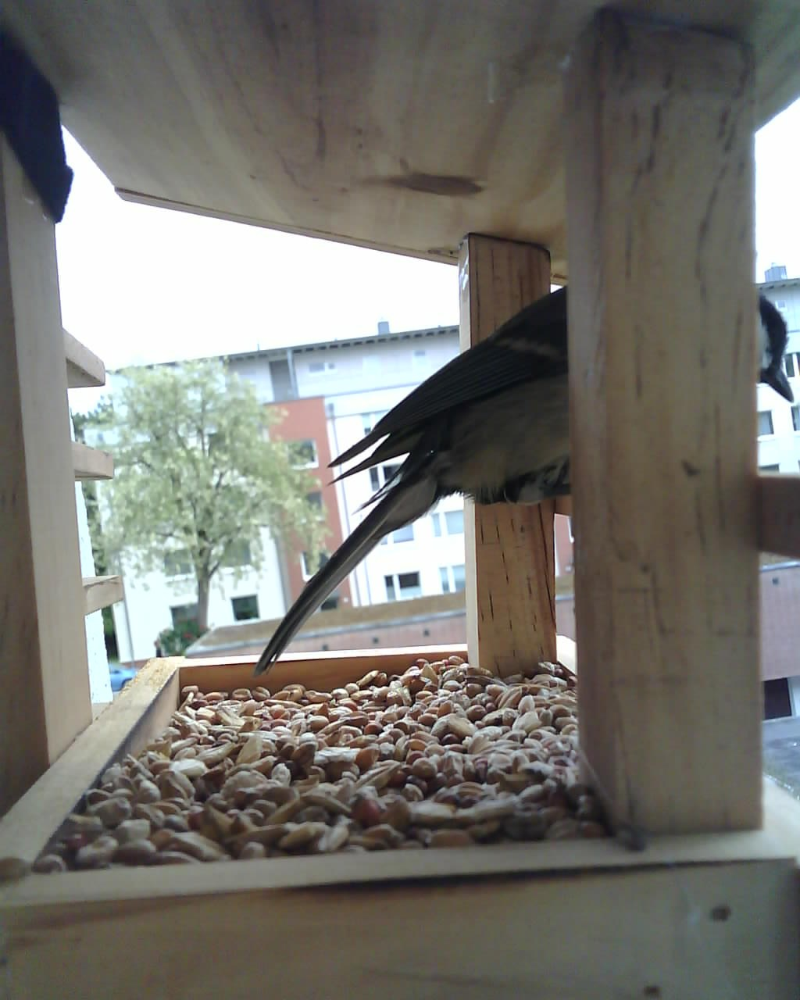</td>
  </tr>
</table>

## Web app

<table>
  <tr>
    <td align="center" width="20%">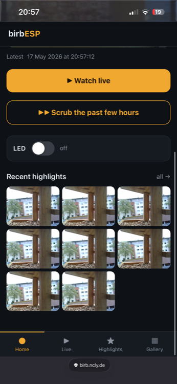<br><sub>Home</sub></td>
    <td align="center" width="20%">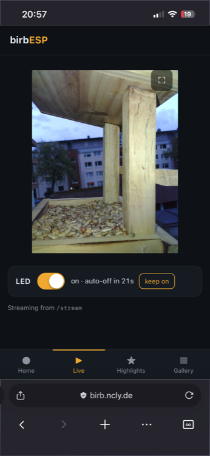<br><sub>Live</sub></td>
    <td align="center" width="20%">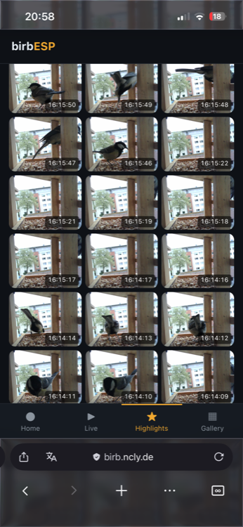<br><sub>Highlights</sub></td>
    <td align="center" width="20%">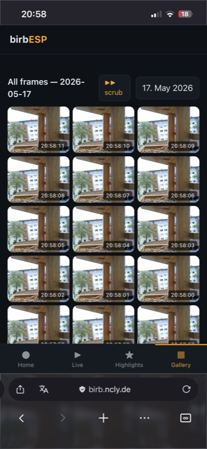<br><sub>Gallery</sub></td>
    <td align="center" width="20%">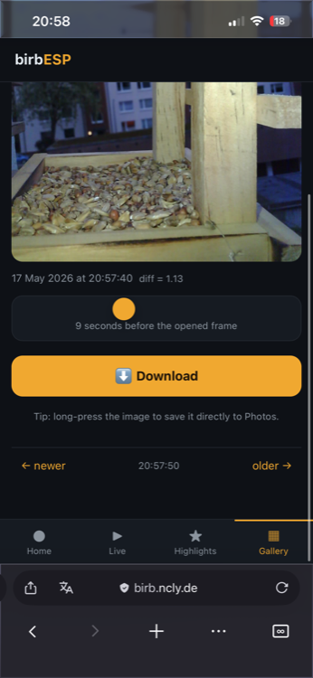<br><sub>Frame detail</sub></td>
  </tr>
</table>

- **Home** — latest still, Watch Live, Scrub, LED toggle, recent highlights.
- **Live** — MJPEG with fullscreen and the LED auto-off countdown.
- **Highlights** — auto-curated reel of frames where motion was detected.
- **Gallery** — every frame, by day, paginated.
- **Frame detail** — full image, Download, and a neighbouring-frame
  scrubber to see what happened in the seconds around a visit.

## Build

<p align="center">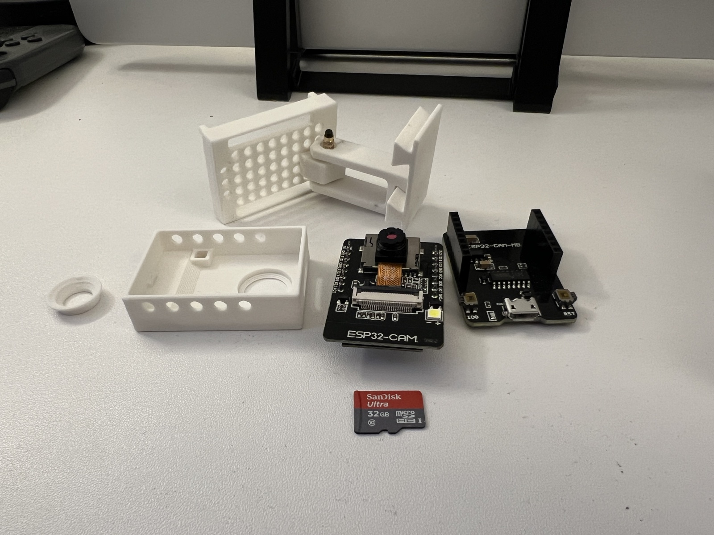</p>

Two soldered wires (5 V + GND from the Wemos 18650 shield to the cam),
one micro-USB cable for charging, a fabric tie for the cam mount, a
zip-tie for the battery pack. Both cases printed on a regular FDM
printer; no supports.

<table>
  <tr>
    <td width="50%">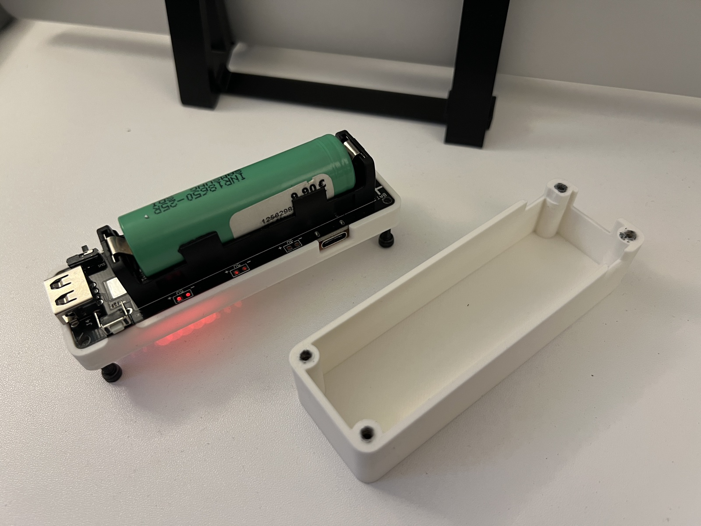</td>
    <td width="50%">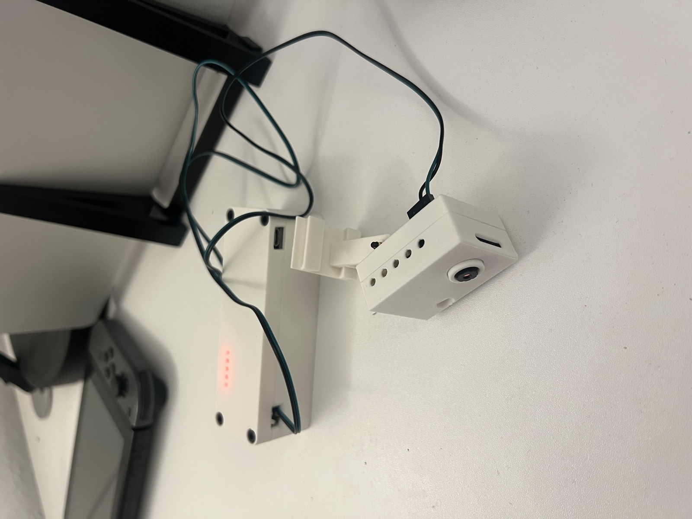</td>
  </tr>
</table>

## Installed

<p align="center">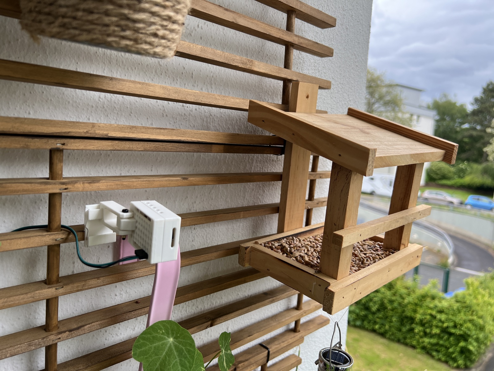</p>

Cam strapped to a balcony trellis a few centimetres from the feeder.
Battery pack zip-tied under the overhead trellis, USB-C trailing back
through the window to a wall charger — the Wemos shield runs as a UPS,
so the cell trickle-charges from mains while the cam runs from the
boosted 5 V rail. Brief power blips don't reboot the cam.

<table>
  <tr>
    <td width="33%">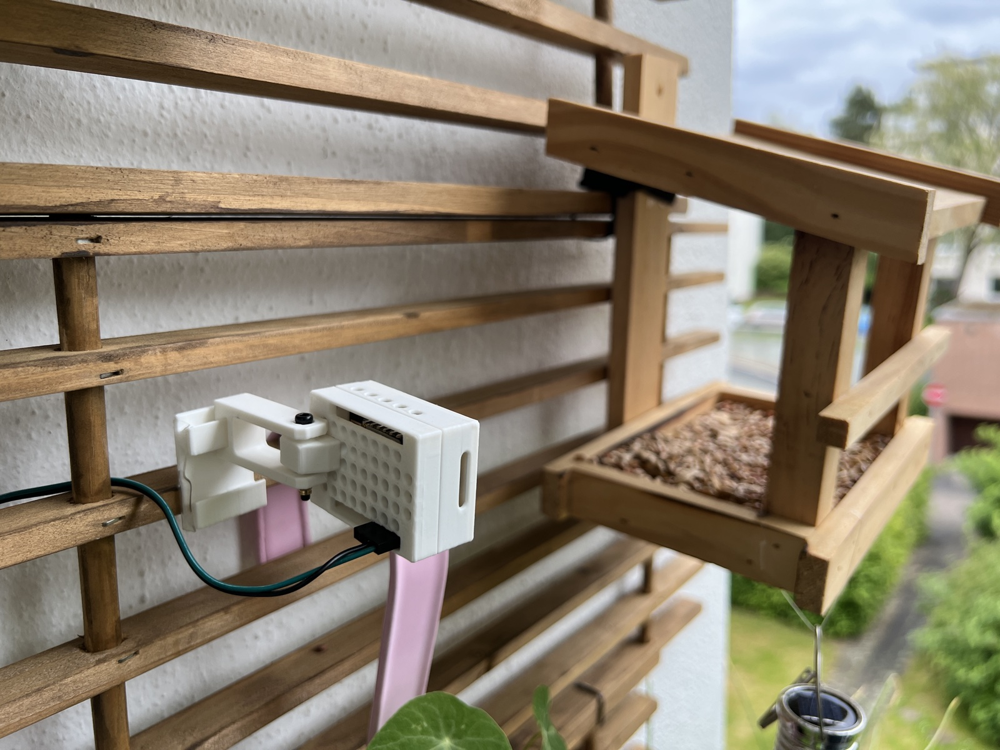</td>
    <td width="33%">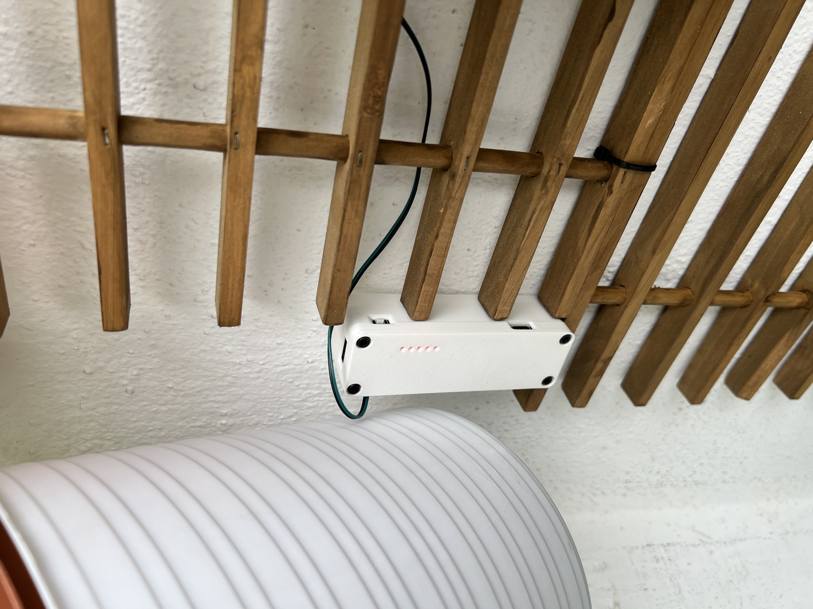</td>
    <td width="33%">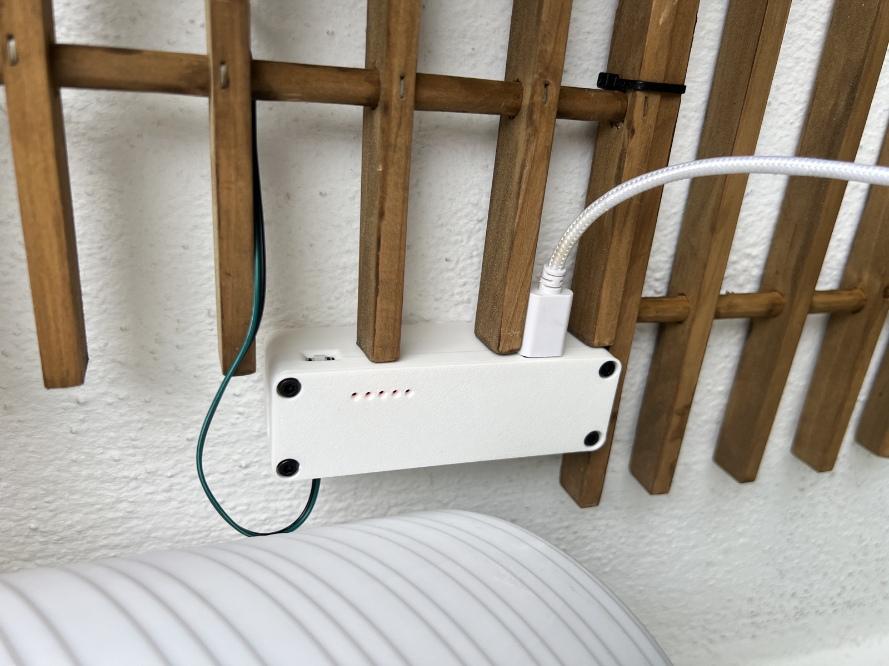</td>
  </tr>
</table>

## Architecture

```
Browser  ──HTTPS──►  nginx  ──►  birbESP container (FastAPI, SQLite index)
                       ▲                  ▲
                       │                  │ stores 1 fps JPEGs
                       │                  │
                       │              ESP32-CAM  ──HTTP──►  /api/upload
                       │                  │
                       └─ /stream proxy ◄─┘   (MJPEG, live view)
```

Same hostname (`birb.local` via mDNS, or whichever DNS name you give the
container) for everything browser-facing; cam talks plain HTTP on a
dual-bound container port so TLS handshake cost doesn't kill 1 fps.

## Quickstart (no hardware required)

```sh
cd server && docker compose up --build &
python -m venv .venv && source .venv/bin/activate
pip install -r tools/requirements.txt
python tools/fake_cam.py --url http://localhost:8080/api/upload
```

Open `http://localhost:8080/` from a phone via the host's LAN IP — fake
frames will appear, highlight tagging works as if the real cam were on.

## Layout

```
docs/        spec, hardware notes, deploy guide, gotchas, photos
3d-prints/   links to the printed cases
server/      FastAPI + Docker — receives uploads, hosts the web UI
firmware/    ESP32-CAM side — PlatformIO + Arduino
tools/       development helpers (fake_cam.py)
```

## Docs

- [`docs/specs/birb-esp.md`](docs/specs/birb-esp.md) — design spec
- [`docs/hardware.md`](docs/hardware.md) — BOM, wiring, flashing
- [`docs/deploy.md`](docs/deploy.md) — local dev + homelab deploy
- [`docs/gotchas.md`](docs/gotchas.md) — hard-won lessons from the build
- [`3d-prints/`](3d-prints/) — links to the printed cases

## License

MIT. See [`LICENSE`](LICENSE).
